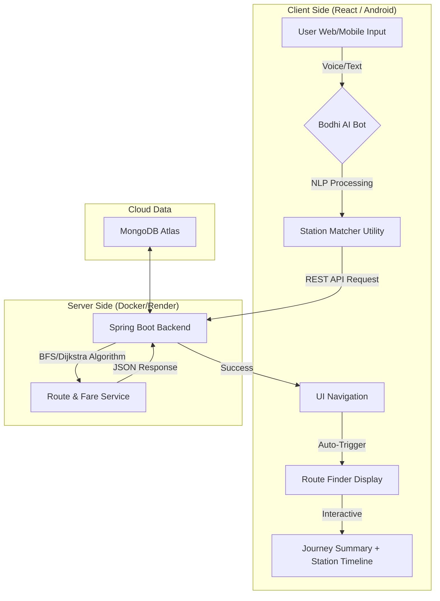

<p align="center">
  
</p>
<h1 align="center">🚇 Patna Metro Route Finder</h1>

<p align="center">


</p>
<!--
https://github.com/user-attachments/assets/a815c282-29fa-4318-af81-52f6d5ec7c73
-->
[](https://app.netlify.com/projects/patna-metro/deploys)
<h3> Project Overview</h3>
<p>Patna Metro Route Finder is a high-performance system that connects a <b>React</b> frontend and <b>Android</b> app with a <b>Spring Boot</b> backend to provide real-time route finding, fare estimation, and AI-powered assistance.</p>

### 📡 Full System Interaction & APIs

The ecosystem consists of three main pillars: **Web**, **Mobile**, and **Cloud Backend**.

| Component | Role | Interaction Channel |
|-----------|------|---------------------|
| **Frontend (React)** | Core Web UI | Axios $\rightarrow$ Render API |
| **Mobile App** | On-the-go access | REST API $\rightarrow$ Render API |
| **Backend (Spring Boot)** | Decision Engine | Docker Container on Render |
| **Database (MongoDB)** | Persistent Storage | Spring Data MongoDB |

#### **API Flow Sequence:**
1. **Initial Sync**: When the app starts, it hits `/api/stations` to cache all available station metadata locally.
2. **Dynamic Search**: When a user selects two stations:
   - **Route API**: `/api/stations/route` calculates the sequence of stations.
   - **Fare API**: `/api/fare` uses path length to determine slab (₹15, ₹20, etc.).
   - **Time API**: `/api/estimated-time` predicts travel duration based on station count + interchange penalty.
3. **AI Bot Processing**: The Bot hits a specialized `/api/bot/voice-route` endpoint that handles natural language queries and returns a "Hindi Speech Script".

<h3>Features</h3>
<ul>
<li><b>Inter-line Routing</b>: Finds the shortest path between Blue and Red lines via <b>Patna Junction</b> interchange.</li>
<li><b>Intelligent Matching</b>: Uses fuzzy search to match user voice input even with dialects.</li>
<li><b>Scalable Deployment</b>: Backend is fully containerized with <b>Docker</b> for one-click deployment to Render/AWS.</li>
<li><b>Persistent Visits</b>: Real-time visit counter tracked via MongoDB.</li> 
</ul>

<h3> Tech Stack</h3>
<ul>
<li>Backend: Java 21, Spring Boot 3.5.3</li>
<li>Frontend	React 18, TailwindCSS, Vite</li>
<li>Database: MongoDB Atlas or Local MongoDB</li>
<li>Build Tool: Maven</li>
</ul>

<h3>🔧 Setup & Run</h3>
<p>Clone the repository</p>

```bash
git clone https://github.com/yourusername/patna-metro.git
cd patna-metro
```

<h3>Configure MongoDB</h3>

<p>Update application.properties:</p>

```
spring.data.mongodb.uri=mongodb://localhost:27017/patnametro
```

<h3>Build & Run</h3>

<p>Using Maven:</p>

```
mvn spring-boot:run
```

<details> <summary><strong>📁 Patna Metro Backend</strong></summary>
  
```
 patna-metro
 ┣ 📂 .idea
 ┣ 📂 .mvn
 ┣ 📂 src
 ┃ ┗ 📂 main
 ┃ ┃ ┣ 📂 java
 ┃ ┃ ┃ ┗ 📂 com.bihar.patna_metro
 ┃ ┃ ┃ ┃ ┣ 📂 config
 ┃ ┃ ┃ ┃ ┃ ┣ 📄 CorsConfig
 ┃ ┃ ┃ ┃ ┃ ┣ 📄 MongoConfig
 ┃ ┃ ┃ ┃ ┃ ┗ 📄 SwaggerConfig.java
 ┃ ┃ ┃ ┃ ┣ 📂 controller
 ┃ ┃ ┃ ┃ ┃ ┣ 📄 EstimatedTimeController
 ┃ ┃ ┃ ┃ ┃ ┣ 📄 FareController
 ┃ ┃ ┃ ┃ ┃ ┣ 📄 RouteController
 ┃ ┃ ┃ ┃ ┃ ┗ 📄 StationController
 ┃ ┃ ┃ ┃ ┣ 📂 exception
 ┃ ┃ ┃ ┃ ┃ ┣ 📄 GlobalExceptionHandler
 ┃ ┃ ┃ ┃ ┃ ┗ ⚠️ ResourceNotFoundException
 ┃ ┃ ┃ ┃ ┣ 📂 model
 ┃ ┃ ┃ ┃ ┃ ┣ 📄 Route
 ┃ ┃ ┃ ┃ ┃ ┗ 📄 Station
 ┃ ┃ ┃ ┃ ┣ 📂 repository
 ┃ ┃ ┃ ┃ ┃ ┣ 📄 RouteRepository
 ┃ ┃ ┃ ┃ ┃ ┗ 📄 StationRepository
 ┃ ┃ ┃ ┃ ┣ 📂 seeder
 ┃ ┃ ┃ ┃ ┃ ┗ 📄 DataSeeder
 ┃ ┃ ┃ ┃ ┣ 📂 service
 ┃ ┃ ┃ ┃ ┃ ┣ 📄 EstimatedTimeService
 ┃ ┃ ┃ ┃ ┃ ┣ 📄 FareService
 ┃ ┃ ┃ ┃ ┃ ┣ 📄 RouteFinderService
 ┃ ┃ ┃ ┃ ┃ ┣ 📄 RouteService
 ┃ ┃ ┃ ┃ ┃ ┗ 📄 StationService
 ┃ ┃ ┃ ┃ ┗ 📄 PatnaMetroApplication
 ┃ ┃ ┗ 📂 resources
 ┃ ┃ ┃ ┣ 📂 static
 ┃ ┃ ┃ ┣ 📂 templates
 ┃ ┃ ┃ ┗ 📄 application.properties
 ┃ ┗ 📂 test
 ┃ ┃ ┗ 📂 java
 ┃ ┃ ┃ ┗ 📂 com.bihar.patna_metro
 ┃ ┃ ┃ ┃ ┣ 📂 controller
 ┃ ┃ ┃ ┃ ┣ 📂 seeder
 ┃ ┃ ┃ ┃ ┗ 📄 PatnaMetroApplicationTests

```
</details>

<details> <summary><strong>📁 Patna Metro Frontend</strong></summary>
  
```
 Patna_Metro_Frontend
 ┣ 📂 node_modules
 ┣ 📂 public
 ┣ 📂 src
 ┃ ┣ 📂 assets
 ┃ ┣ 📂 components
 ┃ ┃ ┣ 📂 bot
 ┃ ┃ ┃ ┣ 📄 Bot.jsx
 ┃ ┃ ┃ ┗ 📄 botService.js
 ┃ ┃ ┣ 📂 Journey
 ┃ ┃ ┃ ┣ 📄 JourneySummary.jsx
 ┃ ┃ ┃ ┣ 📄 RouteForm.jsx
 ┃ ┃ ┃ ┗ 📄 RouteStations.jsx
 ┃ ┃ ┣ 📂 metro
 ┃ ┃ ┃ ┣ 📄 InterchangeIcon.jsx
 ┃ ┃ ┃ ┗ 📄 LineBadge.jsx
 ┃ ┃ ┣ 📂 ui
 ┃ ┃ ┃ ┣ 📄 Button.jsx
 ┃ ┃ ┃ ┗ 📄 LanguageSelect.jsx
 ┃ ┃ ┣ 📄 DisclaimerPopup.jsx
 ┃ ┃ ┣ 📄 Footer.jsx
 ┃ ┃ ┣ 📄 Hero.jsx
 ┃ ┃ ┣ 📄 MetroMapModal.jsx
 ┃ ┃ ┣ 📄 MetroTimeline.jsx
 ┃ ┃ ┣ 📄 Navbar.jsx
 ┃ ┃ ┣ 📄 RouteFinder.jsx
 ┃ ┃ ┣ 📄 StationCard.jsx
 ┃ ┃ ┗ 📄 StationTrack.jsx
 ┃ ┣ 📂 locales
 ┃ ┃ ┣ 📄 en.json
 ┃ ┃ ┗ 📄 hi.json
 ┃ ┣ 📂 pages
 ┃ ┃ ┣ 📂 legal
 ┃ ┃ ┃ ┣ 📄 PrivacyPolicy.jsx
 ┃ ┃ ┃ ┣ 📄 Sitemap.jsx
 ┃ ┃ ┃ ┗ 📄 TermsOfService.jsx
 ┃ ┃ ┣ 📄 About.jsx
 ┃ ┃ ┣ 📄 FareInfo.jsx
 ┃ ┃ ┣ 📄 Home.jsx
 ┃ ┃ ┣ 📄 MapPage.jsx
 ┃ ┃ ┗ 📄 NotFound.jsx
 ┃ ┣ 📂 services
 ┃ ┃ ┗ 📄 api.js
 ┃ ┣ 📂 utils
 ┃ ┃ ┣ 📄 metroData.js
 ┃ ┃ ┗ 📄 Stations.json
 ┃ ┣ 📄 App.css
 ┃ ┣ 📄 App.jsx
 ┃ ┣ 📄 i18n.js
 ┃ ┣ 📄 index.css
 ┃ ┣ 📄 main.jsx
 ┣ 📄 .gitignore
 ┣ 📄 eslint.config.js
 ┣ 📄 index.html
 ┣ 📄 package-lock.json
 ┣ 📄 package.json
 ┣ 📄 postcss.config.js
 ┣ 📄 README.md
 ┣ 📄 tailwind.config.js
 ┗ 📄 vite.config.js
```
</details>


## 📡 **API Endpoints**

| Method | Endpoint | Description |
|--------|----------|-------------|
| `GET` | `/api/stations` | Get all stations for dropdowns |
| `GET` | `/api/stations/route` | Find route between two stations |
| `GET` | `/api/fare` | Get fare for a specific journey |
| `GET` | `/api/estimated-time` | Get estimated travel duration |
| `POST` | `/api/bot/voice-route` | AI Bot natural language query |


<h3>Haversine-Powered Distance Calculation</h3>

```
// StationService.java
public double calculateDistance(Station s1, Station s2) {
    double lat1 = s1.getLocation().getLat();
    double lon1 = s1.getLocation().getLng();
    // ... (Haversine implementation)
    return 12742 * Math.asin(Math.sqrt(a)); // km
}

```
<p>🌍 Earth's curvature-aware measurements between stations

Cached results in Redis for frequent routes</p>


<h3>Haversine Formula</h3>

```
a = sin²(Δφ/2) + cos(φ1) * cos(φ2) * sin²(Δλ/2)
c = 2 * atan2(√a, √(1−a))
d = R * c 

```
<p>Where φ = latitude, λ = longitude, R = Earth's radius (6371 km)

Precision: ±0.3% error margin vs. Vincenty formula
</p>
<h3> Bot workflow</h3>
<p align="center">
  
</p>

 <h3>  Java Code → Docker Image </h3>
<p align="center">
  
</p>

<h3>Dockerfile Example:</h3>

```

FROM openjdk:17-jdk
COPY target/app.jar /app.jar
CMD ["java", "-jar", "/app.jar"]
```

<!---
<h3>Push to AWS ECR (Elastic Container Registry)</h3>
<p align="center">
  
</p>
--->

<!--
<h3>Commands:</h3>

```
aws ecr get-login-password | docker login --username AWS --password-stdin ACCOUNT_ID.dkr.ecr.us-east-1.amazonaws.com
docker tag myapp:latest ACCOUNT_ID.dkr.ecr.us-east-1.amazonaws.com/myapp:latest
docker push ACCOUNT_ID.dkr.ecr.us-east-1.amazonaws.com/myapp:latest
```
--->

<!---
<h3>Deploy to AWS
Option A: ECS Fargate (Serverless Containers)</h3>
<p align="center">
  
</p>
--->

<!---
<h3>Elastic Beanstalk (Single Command)</h3>

```
eb init -p docker myapp
eb create myapp-env
```
--->

<h3>Contributing</h3>
<p>Contributions are welcome! Please create issues or pull requests to suggest improvements or new features.</p>
<p align="center">
  
</p>

## 🏗️ Architecture & Workflow

The app follows a modern client-server architecture. Below is the workflow for a typical user journey (Route Finding):


